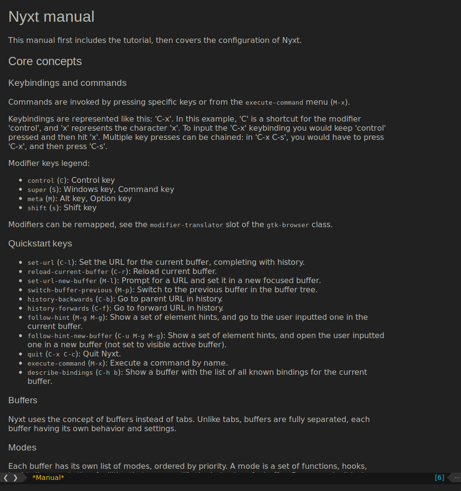

# nyxt-init

Init files for the
[nyxt](https://github.com/atlas-engineer/nyxt) browser.



# Files

## fill-credentials.lisp

An attempt to auto-fill login credentials.  The entry point
is `fill-credentials`.

You can semi-automate the use of this with:
``` common-lisp
(define-configuration web-buffer
  ((buffer-loaded-hook
    (reduce #'hooks:add-hook
	    (mapcar #'nyxt::make-handler-buffer (list #'nyxt::fill-credentials-if-login-present))
	    :initial-value %slot-default%))))
```
once `fill-credentials.lisp` is loaded (and you have a
password interface setup!).

## status.lisp

A low-clutter status bar.  Just history forward/back on the
left and page url/title in the middle.  Mouse-over the small
right block to see the active modes.

## style.lisp

A moderately thorough-going dark theme.  If you find any
browser chrome that hasn't been darkly styled: it's a bug!
